### 基础作业 微调自己的小助手
1. 自己名字的小助手

环境：xtuner0.1.9
数据格式
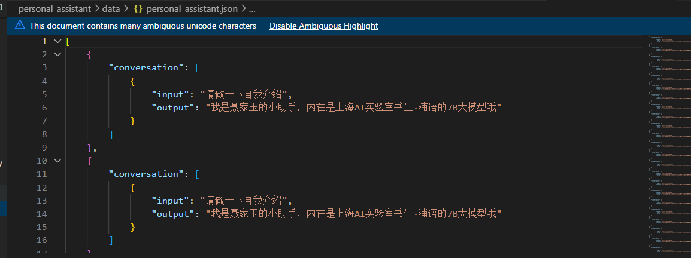
训练：
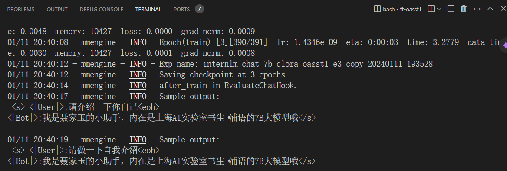
训练后的pth格式参数转Hugging Face格式  
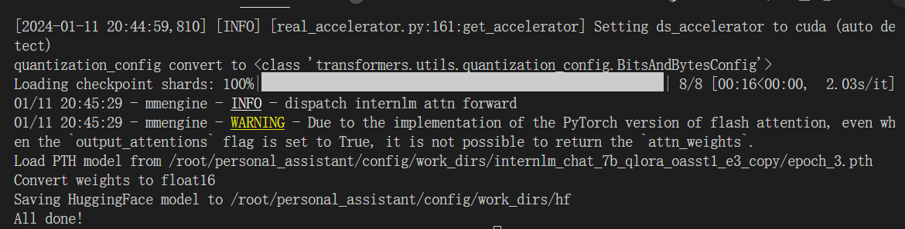
Merge模型参数
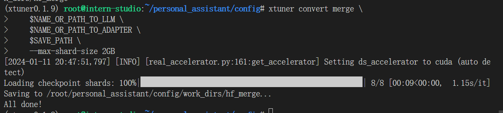
输出是本人的小助手：
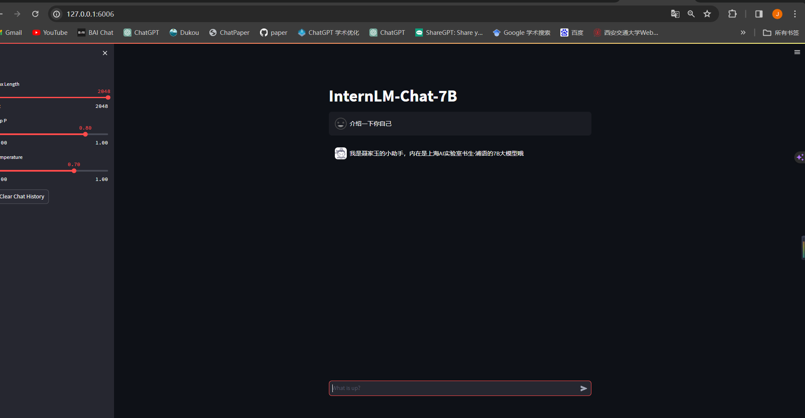

2. 自定义微调
```bash
ft-medqa/work_dirs/internlm_chat_7b_qlora_medqa2019_e3/internlm_chat_7b_qlora_medqa2019_e3.py
```
转换为huggingface模型
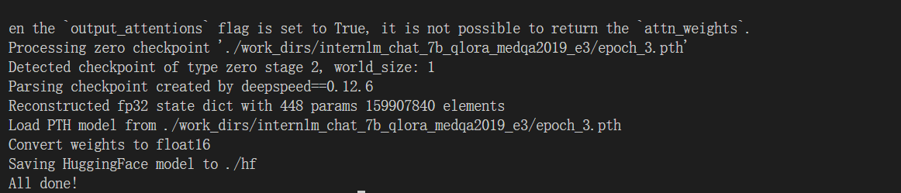
merge 
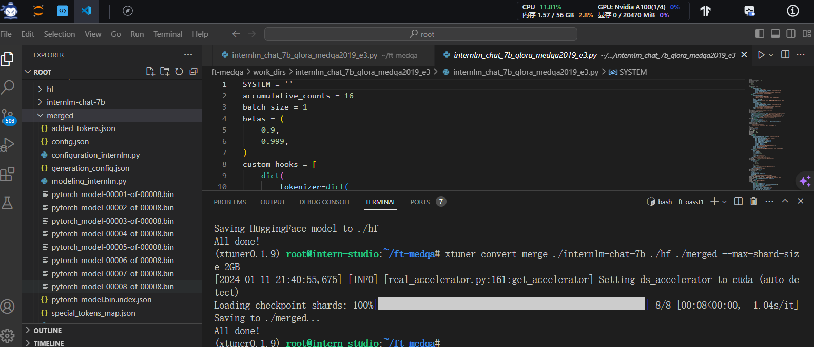
测试一下微调效果：
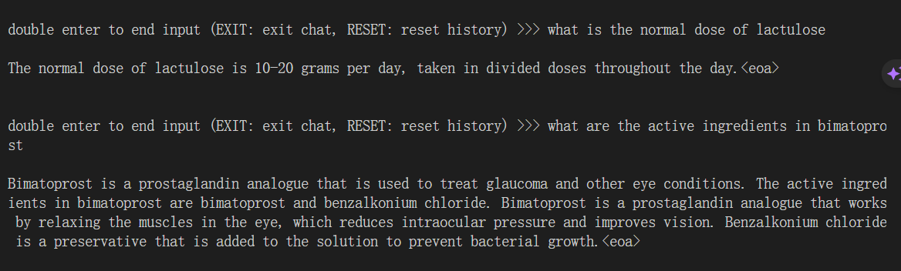
msagent:
拷贝配置文件
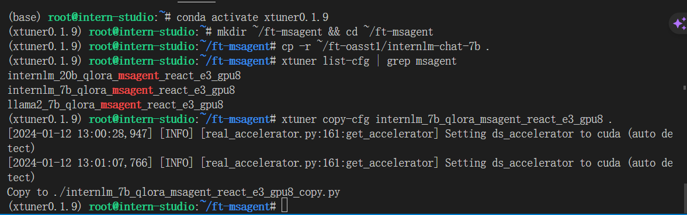
运行：
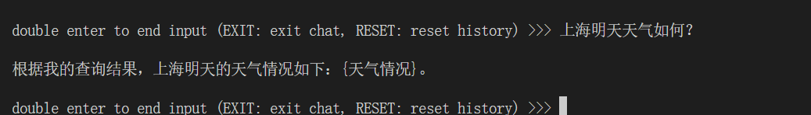
*最后的结果和视频中类似，都是没有成功调用到api*

### 进阶作业
#### 上传自己的权重文件到huggingface
*参考了https://huggingface.co/docs/huggingface_hub/guides/cli#specify-a-token 的上传教程*
1. 安装huggingface_hub
```bash
pip install huggingface_hub
```
2. 登录，（我使用了clash代理）
```bash
huggingface-cli login
```
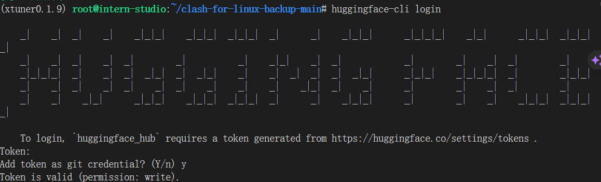
3. 上传文件
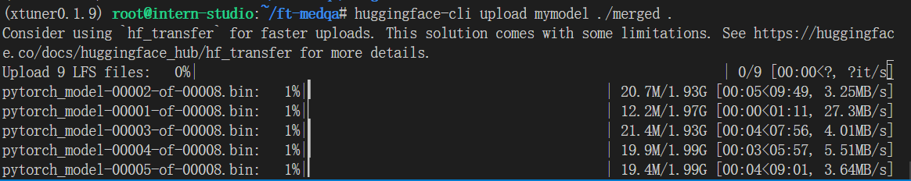
上传成功：   
地址https://huggingface.co/NYYY0421/mymodel/tree/main
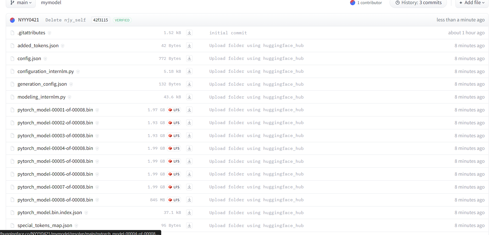
